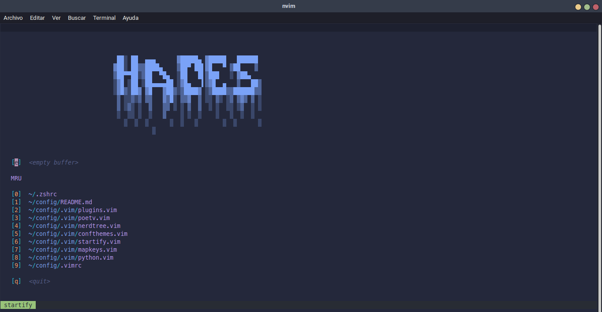
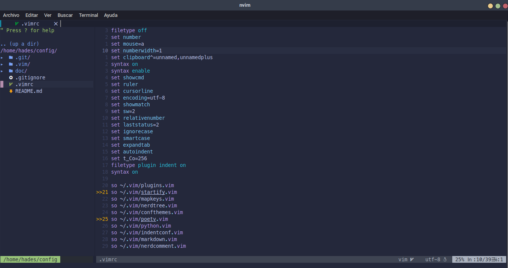
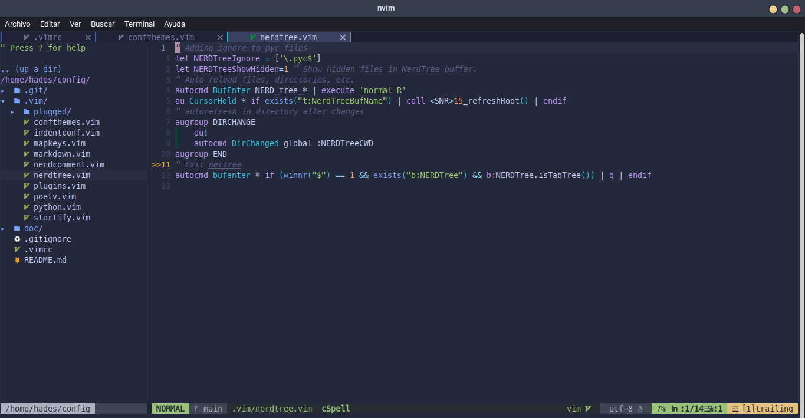
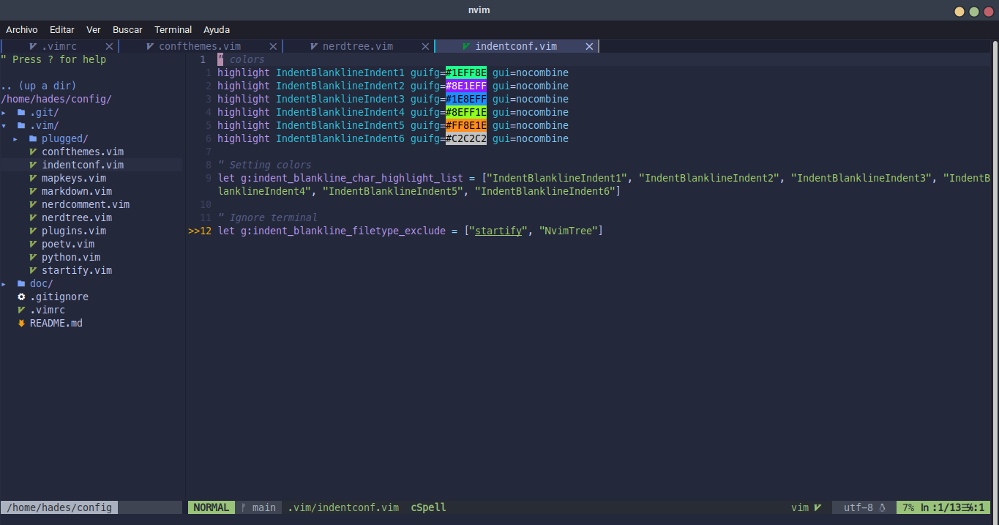
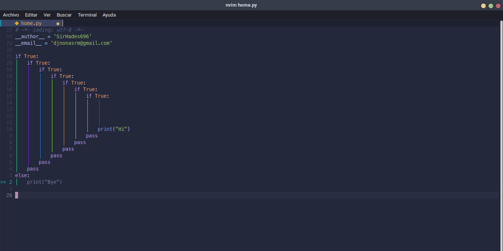

# Configuración NVIM Linux
## Screenshots

## Requisitos

* Instalar NodeJS
* Instalar Yarn
* Instalar Cmake
* Instalar Ninja

# Plugins

Instalar Vim Plug para administrar todos los plugins

* Disponible en: https://github.com/junegunn/vim-plug

## CTRLP

Para búsquedas FZF.

* Disponible en: https://github.com/kien/ctrlp.vim 

## NerdCommenter

Para comentar líneas de texto de forma automática.

* Disponible en: https://github.com/preservim/nerdcommenter

## Matchit 

Permite moverse entre código bajo expresiones regulares usando el símbolo de %.

* Disponible en: https://github.com/tmhedberg/matchit/

## Nerdtree

Visualizador de carpetas en forma de arbol (similar a VSC).

* Disponible en: https://github.com/preservim/nerdtree

## Vim Airline

Agrega una barra inferior para mostar el modo que se encuentra activo en NVIM. Además, se pueden agregar configurar temas a esta barra.

* Disponible en: https://github.com/vim-airline/vim-airline
* Disponible en: https://github.com/vim-airline/vim-airline-themes

## Polyglot

Detección de sintaxis para varios lenguajes de programación.

* Disponible en: https://github.com/sheerun/vim-polyglot

## Coc

Para el autocompletado de texto y lenguajes de programación.
Requiere: 
* coc-spell-checker
* coc-prettier
* coc-git
* coc-python
* coc-pyright
* coc-json
* coc-docker

* Disponible en: https://github.com/neoclide/coc.nvim

## Vim Fugitive

Integrando GIT a NVIM, permite observar el comportamiento de GIT dentro de NVIM sin salir de este.

* Disponible en: https://github.com/tpope/vim-fugitive

## Auto Pais

Para detectar si se están cerrando corchetes, parentesis, etc.

* Disponible en: https://github.com/windwp/nvim-autopairs

## Bar Bar (TABS)

Agrega las barras de navegación para cada uno de los buffers abiertos. Además, para agregar iconos a los archivos se usa a nvim-web-devicons.

* Disponible en: https://github.com/romgrk/barbar.nvim
* Disponible en: https://github.com/kyazdani42/nvim-web-devicons

## Vim Devicons

Iconos para Nerdtree

* Disponible en: https://github.com/ryanoasis/vim-devicons

## Tokyo Night

El mejor tema para visualizar código.

* Disponible en: https://github.com/folke/tokyonight.nvim

## Startify

Agrega una personalización al inicio de Nvim, se puede agregar un logo personalizado.

* Disponible en: https://github.com/mhinz/vim-startify

## Easymotion

Permite moverte entre palabras de forma rápida.

* Disponible en: https://github.com/easymotion/vim-easymotion

## Poet-V

Permite identificar los entornos virtuales de Python

* Disponible en: https://github.com/petobens/poet-v

## MarkDown Preview

Permite visualizar archivos del tipo README.md, es necesario ejecutar Yarn para instalar correctamente el plugin (Revisar archivo de ayuda :h MarkDown...).

* Disponible en: https://github.com/iamcco/markdown-preview.nvim

## Vim NerdTree Syntax Highlight

Agrega iconos y colores a NerdTree

* Disponible en: https://github.com/tiagofumo/vim-nerdtree-syntax-highlight

## Indent BlankLine

Para agregar líneas de colores e identificar las indentaciones en código.

* Disponible en: https://github.com/lukas-reineke/indent-blankline.nvim

## Vim CSS Color

Para visualizar el color escrito en Hexa, RGB, etc.

* Disponible en: https://github.com/ap/vim-css-color

## Neoclip

Para tener conexión de clipboard entre Nvim y SO (Requiere de Cmake y Ninja para completar la instlación).

* Disponible en: https://github.com/matveyt/neoclip
